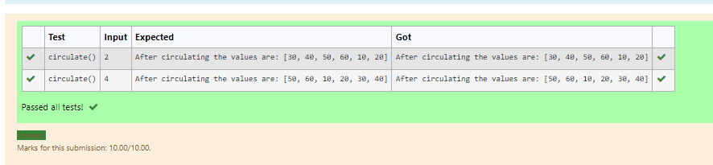

# Circulate-the-values-of-N-variables
## Aim:
To write a python program to circulate the n variables using function concept
## Equipment’s required:
PC
Anaconda - Python 3.7
## Algorithm: 
### Step 1:
 Start the program.
### Step 2: 
Get the value from the user for the number of rotation
### Step 3: 
Using the slicing concept rotate the list

### Step 4:
Print the swapped values.
### Step 5: 
End the program.
## Program:
```
a=int(input())
b=int(input())
t=a
a=b
b=t
print("Swapped values are:",a,b)
```


## Output:


## Result:
Thus the circulate the values of N varaibles has been calculated.
